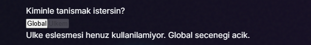
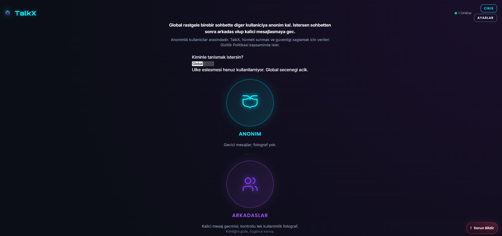
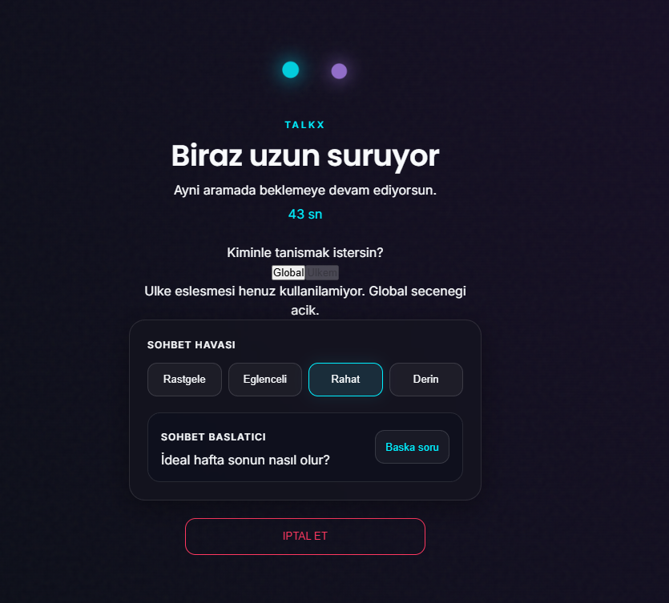
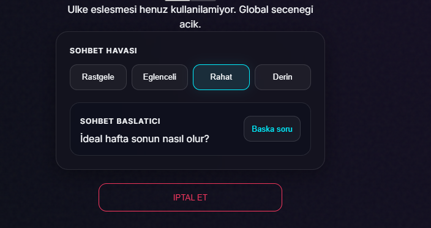
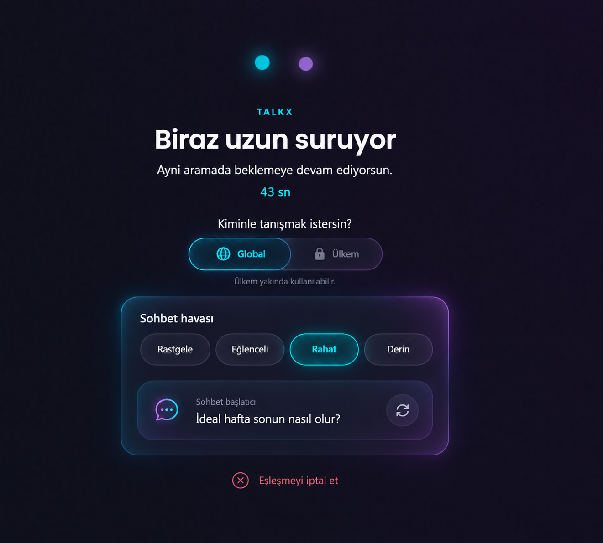
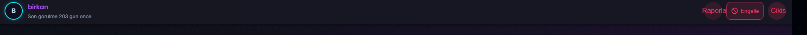
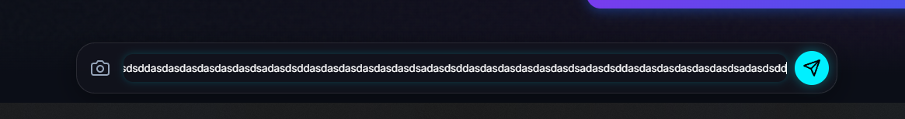

# TalkX Frontend Görsel İnceleme Notları

Bu dosya deploy sonrası görsel inceleme bulgularını, tasarım kararlarını ve doğrulama ölçütlerini tek yerde toplar. Bulgular önce burada netleştirilir; kod değişiklikleri daha sonra toplu olarak uygulanır.

## Güncel inceleme durumu

- **Tarih:** 28 Eylül 2026
- **Durum:** 7 frontend bulgusunun uygulaması ve görsel doğrulaması tamamlandı.
- **Kayıt:** 7 bulgu (`HOME-001`–`HOME-004`, `MATCH-001`, `CHAT-001`–`CHAT-002`)
- **Görsel kanıt ve referans:** 10 kalıcı ekran görüntüsü
- **Doğrulama:** Lint, 50/50 otomatik test, production build ve masaüstü/dar ekran görsel QA başarılı
- **Sonraki aşama:** Backend deployundan sonra canlı hesapta otomatik ülke kaydı ve `Ülkem` eşleşmesi smoke testi
- **Sınır:** Bu kapanış yalnız mevcut görsel taramayı ifade eder; yeni bir bulgu görülürse aynı dosyaya eklenebilir.

## Çalışma yöntemi

- Bu dosya bulgu, karar, uygulama ve doğrulama kaydını birlikte tutar.
- Aynı soruna ait yeni görseller ayrı madde yerine mevcut kayda eklenir.
- `Düzeltildi` kaydı görsel doğrulama yapılana kadar tamamlanmış sayılmaz.

## Durumlar

- `Bekliyor`: Kaydedildi, henüz uygulanmadı.
- `Kararlaştırıldı`: Tasarım yönü netleşti.
- `Düzeltildi`: Kod değişikliği tamamlandı, doğrulama bekliyor.
- `Test edildi`: Hedef görünüm ve davranış doğrulandı.

---

## Ana Sayfa

### HOME-001 — Üst tanıtım metni fazla büyük ve görsel hiyerarşiye yabancı

- **Durum:** Test edildi
- **Öncelik:** Orta
- **Kapsam:** Ana sayfa; masaüstü ve mobil
- **Kanıt:** `frontend-visual-review-assets/home-intro-copy.png`

#### Mevcut durum

Üst-orta bölümde beyaz, kalın bir ana açıklama ile gri bir gizlilik/hizmet açıklaması bulunuyor. Metinler gerekli birincil içerik olmamasına rağmen fazla yer kaplıyor ve seçim alanından görsel ağırlık çalıyor.

#### Kararlaştırılan yön

Metin tamamen kaldırılmayacak. Görsel olarak hoş bir karşılama unsuru olduğu için TalkX tasarım diline uyarlanarak korunacak:

- içerik kısaltılacak,
- yazı boyutu ve kalınlığı azaltılacak,
- beyaz ve gri katmanların ağırlığı dengelenecek,
- blok daha az dikey alan kullanacak,
- Gizlilik Politikası ifadesi korunursa gerçek bir bağlantı olacak,
- ana seçimlerden rol çalmayan ikincil bir tanıtım bloğuna dönüşecek.

Metin kısaltıldı, ikincil gizlilik satırı gerçek bağlantıyla korundu ve tipografi ana eylemlerden daha sakin hâle getirildi.

#### Kabul kriterleri

- Blok ilk bakışta ana eylem gibi görünmemeli.
- Aynı anlam daha kısa ve tekrarsız aktarılmalı.
- TalkX’in koyu/neon tasarım sistemiyle uyumlu olmalı.
- Ana sayfanın tek ekrana sığmasına engel olacak yükseklik oluşturmamalı.
- Dar ekranlarda kontrollü satır kırmalı; taşmamalı.

---

### HOME-002 — “Kiminle tanışmak istersin?” alanı ham HTML görünümünde

- **Durum:** Test edildi
- **Öncelik:** Acil
- **Kapsam:** Ana sayfa ve eşleşme/bekleme ekranı; tüm ekran boyutları
- **Kanıt:** `frontend-visual-review-assets/home-match-scope-unstyled.png`, `frontend-visual-review-assets/home-country-unavailable.png`, `frontend-visual-review-assets/matching-screen-overview.png`
- **Onaylı görsel yön:** `frontend-visual-review-assets/matching-redesign-reference-v1.png` içindeki `Global / Ülkem` kontrolü

#### Mevcut durum

`Global` ve `Ülkem` seçimleri tarayıcının varsayılan HTML kontrolleri gibi görünüyor. Seçili ve pasif durumlar yalnızca ham buton görünümü ile soluk gri tondan ayrılıyor. “Ülke eşleşmesi henüz kullanılamıyor. Global seçeneği açık.” mesajı da tasarlanmış bir durum açıklaması yerine düz metin olarak kalmış.

Bu alan sayfanın neon/koyu arayüz diliyle açıkça çelişiyor ve CSS yüklenmemiş ya da ekran yarım kalmış izlenimi veriyor.

#### Revizyon hedefi

- TalkX tasarım sistemine ait gerçek bir seçim bileşeni yapılacak.
- Anasayfa ve eşleşme/bekleme ekranı aynı ortak `Global / Ülkem` bileşenini kullanacak; iki ekranda ayrı stil üretilmeyecek.
- Onaylanan V1 referansındaki cam yüzey, segmentli pill yapısı, seçili cyan vurgu ve pasif ülke görünümü temel alınacak.
- `Global` seçili durumu net ve erişilebilir gösterilecek.
- Kullanılamayan `Ülkem` seçeneği hem görünüm hem davranış açısından açıkça pasif olacak.
- Başlık, kontrol ve durum açıklaması tek bir görsel grup hâline gelecek.
- Ham tarayıcı butonu veya sistem fontu hissi kalmayacak.
- Klavye odağı ve erişilebilir durum bilgisi korunacak.

Anasayfa ve eşleşme ekranı aynı erişilebilir, ikonlu ve segmentli cam yüzey bileşenini kullanıyor.

#### Teknik neden — ülke eşleşmesi neden kullanılamıyor?

Frontend bu seçeneği kendi başına kapatmıyor. WebSocket bağlantısındaki `welcome.matchScopes.countryAvailable` değeri false geldiğinde `Ülkem` pasif hâle geliyor.

Backend, ülke eşleşmesini yalnız kullanıcının `user_match_country` tablosunda şu şartları karşılayan canonical kaydı varsa açıyor:

- geçerli iki harfli ISO ülke kodu,
- `status = 'eligible'`,
- `confidence = 'policy_verified'`.

Kayıt yoksa, ülke kodu geçersizse veya durum `unavailable` ise `MATCH_COUNTRY_UNAVAILABLE`; kayıt stale/disputed ya da doğrulanmamışsa `MATCH_COUNTRY_STALE` dönüyor.

İlk incelemede normal kayıt/giriş akışında `user_match_country` tablosuna gerçek kullanıcı kaydı yazan production yolu bulunmadığı için ülke yeteneği kapalı kalıyordu. Backend `9ab004f` ile bu eksik tamamlandı: IP yalnız backend içinde çalışan yerel country-only veritabanında çözülüyor; kayıt, giriş, authenticated WebSocket ve profil akışları canonical kaydı kendiliğinden besliyor; mevcut aktif profiller başlangıç worker'ı ile toplu tamamlanıyor. Geçici çözümleme hatası daha önce doğrulanmış ülkeyi silmiyor ve IP üçüncü tarafa gönderilmiyor.

#### Kabul kriterleri

- Hiçbir parça varsayılan HTML kontrolü gibi görünmemeli.
- Seçili `Global`, pasif `Ülkem` ve klavye odağı kolayca ayırt edilmeli.
- Pasif seçeneğe basmak yanlış bir eşleşme akışı başlatmamalı.
- Durum açıklaması kısa, tasarımla uyumlu ve kompakt olmalı.
- Mobil ve masaüstünde hizalama, dokunma alanı ve metin taşması doğrulanmalı.
- Aynı veri durumu anasayfa ve eşleşme ekranında aynı görsel state üretmeli.
- Ortak bileşendeki bir stil veya erişilebilirlik düzeltmesi iki ekrana da yansımalı.

---

### HOME-003 — Ana sayfa gereksiz dikey kaydırma oluşturuyor

- **Durum:** Test edildi
- **Öncelik:** Acil
- **Kapsam:** Ana sayfa; özellikle masaüstü
- **Kanıt:** `frontend-visual-review-assets/home-overview-scroll.png`

#### Mevcut durum

Üst açıklama, eşleşme tercihi, büyük seçim kartları ve geniş dikey boşluklar ekran yüksekliğini aşıyor. İkinci seçenek ekranın altına taşıyor ve sayfada gereksiz dikey kaydırma oluşuyor. İçerik yoğunluğu kaydırmayı gerektirmediği için arayüz sıkışmış ve ölçeksiz görünüyor.

#### Kararlaştırılan yön

Standart masaüstü görünümünde ana sayfanın temel içeriği tek viewport içine sığacak ve dikey scrollbar oluşmayacak. Sonuç yalnızca `overflow: hidden` ile içerik kesilerek sağlanmayacak; metin, boşluklar, seçim alanı ve kart ölçüleri birlikte dengelenecek.

İncelenecek alanlar:

- header ile içerik arasındaki boşluk,
- tanıtım bloğunun yüksekliği,
- eşleşme tercihi alanının ölçüleri,
- Anonim ve Arkadaşlar kartlarının ölçüleri,
- kartlar arasındaki boşluk ve ayırıcı,
- alt açıklama metinleri,
- sabit “Sorun Bildir” düğmesinin güvenli alanı.

#### Kabul kriterleri

- Standart masaüstü viewportlarında dikey scrollbar görünmemeli.
- Header, tanıtım alanı, tercih kontrolü ve iki ana seçenek kesilmeden aynı ekranda erişilebilir olmalı.
- İçerik gizlenmemeli veya ekranın altına itilmemeli.
- “Sorun Bildir” düğmesi içerikle çakışmamalı.
- Daha kısa ekranlarda ölçüler ve aralıklar kontrollü küçülmeli.
- Küçük mobil ekranlarda kaydırma gerçekten gerekirse içerik kesilmemeli; mobil davranış ayrıca doğrulanmalı.

---

### HOME-004 — Anonim ve Arkadaşlar seçeneklerinin altındaki gri açıklamalar kaldırılmalı

- **Durum:** Test edildi
- **Öncelik:** Yüksek
- **Kapsam:** Ana sayfa; masaüstü ve mobil
- **Kanıt:** `frontend-visual-review-assets/home-mode-descriptions.png`

#### Mevcut durum

Ana seçimlerin altında şu küçük gri açıklamalar yer alıyor:

- Anonim: “Geçici mesajlar; fotoğraf yok.”
- Arkadaşlar: “Kalıcı mesaj geçmişi; kontrollü tek kullanımlık fotoğraf.”

Bu metinler ana sayfada karar vermek için gerekli değil, görsel kalabalık oluşturuyor ve seçeneklerin kapladığı dikey alanı artırarak scrollbar sorununa katkıda bulunuyor.

#### Kararlaştırılan yön

İki açıklama da tamamen kaldırılacak. Yerlerine yeni bir alt metin, tooltip veya başka bir açıklama eklenmeyecek. Seçenekler ikon ve başlıklarıyla yeterince açık, daha temiz bir yapıda bırakılacak.

#### Kabul kriterleri

- Her iki seçeneğin altında gri açıklama metni görünmemeli.
- Metinlerden kalan boşluk, görünmez kapsayıcı veya gereksiz margin/padding kalmamalı.
- İkonlar ve başlıklar kendi aralarında dengeli hizalanmalı.
- Kaldırma sonrasında klavye odağı ve tıklanabilir alan bozulmamalı.
- Değişiklik, `HOME-003` kapsamındaki tek viewport yerleşimine ölçülebilir katkı sağlamalı.

---

## Eşleşme / Bekleme Ekranı

### MATCH-001 — Alt kontrol alanı robotik ve tema dışında görünüyor

- **Durum:** Test edildi
- **Öncelik:** Yüksek
- **Kapsam:** Eşleşme bekleme ekranının eşleşme tercihi, sohbet havası, sohbet başlatıcı ve iptal alanları
- **Korunacak alan:** Dönen atomlar/noktalar, TalkX etiketi, bekleme başlığı, açıklama ve süre göstergesi
- **Kanıt:** `frontend-visual-review-assets/matching-screen-overview.png`, `frontend-visual-review-assets/matching-controls-closeup.png`

#### Önerilen referans tasarım — V1

- **Durum:** Kullanıcı tarafından onaylandı
- **Onay tarihi:** 28 Eylül 2026
- **Dosya:** `frontend-visual-review-assets/matching-redesign-reference-v1.png`

Bu mockup nihai piksel ölçülerini zorunlu kılan bir üretim çıktısı değildir; uygulanacak görsel yönü tanımlar:

- Üstteki atom/nokta animasyonu ve bekleme hiyerarşisi korunur.
- `Global / Ülkem` seçimi kompakt, temaya ait segmentli bir kontrole dönüşür.
- Sohbet havası ağır bir form yerine yumuşak cam yüzey üzerindeki seçim çipleriyle sunulur.
- Seçili `Rahat` durumu cyan ışık ve kontrollü dolgu ile belirtilir.
- Sohbet başlatıcı ayrı bir form kutusu değil, konuşma daveti hissi veren bir karttır.
- Soru değiştirme eylemi büyük yazılı düğme yerine sakin bir ikon eylemidir.
- Eşleşmeyi iptal et eylemi ulaşılabilir kalır ancak ekranın ana odağı olmaz.
- Mockuptaki `Global / Ülkem` bileşeni aynı görsel ve davranış sistemiyle anasayfada da kullanılacaktır.

#### Mevcut durum

Ekranın üst bölümündeki hareketli atom/nokta görseli, büyük bekleme başlığı ve süre göstergesi TalkX atmosferiyle uyumlu ve başarılı. Sorun bunun altındaki kontrol katmanında başlıyor:

- Ham görünen `Global / Ülkem` kontrolü üst bölüm ile alt panel arasında kopukluk yaratıyor.
- “Sohbet Havası” bölümü standart ayar paneli gibi görünüyor.
- Dört eşit, sert sınırlı buton arayüze mekanik bir form hissi veriyor.
- Dış panel, iç soru kutusu ve ayrı buton sınırları üst üste binerek gereğinden fazla çerçeve oluşturuyor.
- “Sohbet Başlatıcı” alanı doğal bir konuşma daveti yerine sistem tarafından üretilmiş form satırı hissi veriyor.
- Büyük kırmızı çerçeveli “İptal Et” düğmesi görsel odağı gereğinden fazla üzerine çekiyor.

Sonuç olarak üstteki canlı ve atmosferik eşleşme deneyimi, altta daha sert ve robotik bir kontrol paneline dönüşüyor.

#### Kararlaştırılan yön

Üst bölümün başarılı görsel karakteri korunacak; alt bölüm TalkX temasına ait daha yumuşak, bütünleşik bir “eşleşme hazırlığı” katmanına dönüştürülecek.

- Alt bölüm tek parça ağır bir ayar kutusu gibi görünmemeli.
- Sert ve tekrar eden çerçeveler azaltılmalı; arka plan, hafif ışık, ton farkı ve boşluklarla daha yumuşak bir hiyerarşi kurulmalı.
- Sohbet havası seçenekleri standart form butonlarından ziyade kompakt, davetkâr seçim çipleri/pilleri gibi ele alınmalı.
- Seçili ruh hâli neon vurgusunu korumalı ancak keskin bir teknik kontrol izlenimi vermemeli.
- Sohbet başlatıcı daha sıcak bir konuşma kartı gibi görünmeli; soru ana içerik, “Başka soru” ise sakin bir ikincil eylem olmalı.
- Büyük harfli teknik etiketlerin ağırlığı azaltılmalı; metin dili ve tipografi daha insani bir tona taşınmalı.
- İptal eylemi ulaşılabilir kalmalı fakat ekranın ana görsel odağı olmamalı; tehlike rengi daha kontrollü kullanılmalı.
- Alt alan ile üstteki atom animasyonu arasında renk, ışık, köşe ve boşluk dili bakımından süreklilik kurulmalı.

Onaylı V1 referansı; yumuşak cam panel, seçim çipleri, konuşma kartı, ikonlu soru yenileme ve ikincil iptal eylemiyle uygulandı.

#### Kabul kriterleri

- Üstteki animasyon, başlık, açıklama ve sayaç mevcut güçlü karakterini korumalı.
- Alt alan ilk bakışta ayarlar/form paneli gibi görünmemeli.
- Kullanıcı seçili sohbet havasını yine kolayca anlayabilmeli.
- Sohbet sorusu okunaklı, “Başka soru” eylemi keşfedilebilir fakat ikincil olmalı.
- İptal eylemi net olmalı ancak sohbet kontrollerinden daha baskın görünmemeli.
- Yinelenen çerçeveler ve sert dikdörtgen hissi belirgin biçimde azalmalı.
- Hover, klavye odağı, seçili ve pasif durumlar erişilebilir biçimde ayırt edilmeli.
- Masaüstü ve mobilde taşma, sıkışma veya gereksiz scrollbar oluşmamalı.
- `HOME-002` kapsamındaki ham ülke kontrolü bu ekranda da aynı tasarım sistemiyle çözülmeli.

---

## Sohbet Ekranı

### CHAT-001 — Üst başlıktaki sohbet eylemleri kaba yazılı düğmeler olarak kalmış

- **Durum:** Test edildi
- **Öncelik:** Acil
- **Kapsam:** Arkadaş sohbeti ve anonim sohbet başlığı
- **Kanıt:** `frontend-visual-review-assets/chat-header-actions-text-buttons.png`

#### Mevcut durum

Sohbet başlığının sağ tarafındaki `Raporla`, `Engelle` ve `Çıkış` eylemleri büyük yazılı düğmeler olarak görünüyor. Düğmelerin şekilleri ve kırmızı tonları birbirinden farklı; eylem grubu hizalı ve ortak bir sistemin parçası gibi durmuyor. Uzun metinler başlık çubuğunu gereksiz yere genişletiyor ve kullanıcı adı/çevrimiçi bilgisi bulunan sol tarafla dengesiz, kaba bir görünüm oluşturuyor.

#### Kararlaştırılan yön

- Üç eylem de anlaşılır simgeler kullanan kompakt başlık düğmelerine dönüştürülecek.
- Görünür `Raporla / Engelle / Çıkış` metinleri başlığın sürekli parçası olmayacak.
- Raporlama için rapor/bayrak, engelleme için engel, çıkış için çıkış/kapı anlamını taşıyan tutarlı ikon ailesi kullanılacak.
- Düğmeler aynı ölçü, köşe, hizalama ve etkileşim dilini paylaşacak.
- Raporlama ve engelleme güvenlik eylemleri; çıkış ise oturum/sohbet eylemi olarak görsel gruplama veya kontrollü ayrımla anlaşılır kalacak.
- Kırmızı renk bütün düğmeleri sürekli alarm durumuna çevirmeyecek; tehlike vurgusu gerektiği yerde ve ölçülü kullanılacak.
- Mevcut raporlama, engelleme ve sohbetten çıkış davranışları değiştirilmeyecek.

#### Erişilebilirlik ve etkileşim

- Metinler görsel olarak kaldırılırken her düğmede açık bir erişilebilir ad korunacak.
- Masaüstünde hover/focus sırasında kısa tooltip gösterilecek: `Raporla`, `Engelle`, `Sohbetten çık`.
- İkon tek başına renge bağımlı olmadan anlaşılır olmalı.
- Klavye odağı görünür olmalı ve sekme sırası mantıklı kalmalı.
- Dokunma hedefleri mobilde rahat kullanılabilecek boyutta olmalı.
- Geri döndürülemez veya etkisi yüksek mevcut onay akışları korunmalı.

#### Kabul kriterleri

- Arkadaş ve anonim sohbet başlıklarında düz yazılı aksiyon düğmeleri görünmemeli.
- Üç ikon aynı tasarım sistemine ait, hizalı ve kompakt görünmeli.
- Kullanıcı adı ve durum bilgisi için yeterli yatay alan kalmalı.
- Dar ekranlarda aksiyonlar taşmamalı, üst üste binmemeli ve kullanıcı bilgisini ezmemeli.
- Tooltip, erişilebilir ad, hover, active ve focus durumları doğrulanmalı.
- Her ikon doğru mevcut işlemi tetiklemeli; eylemler arasında işlev karışıklığı olmamalı.

---

### CHAT-002 — Uzun mesaj yazma alanında alt satıra geçmiyor

- **Durum:** Test edildi
- **Öncelik:** Acil
- **Kapsam:** Arkadaş ve anonim sohbet mesaj yazma alanı; masaüstü ve mobil
- **Kanıt:** `frontend-visual-review-assets/chat-composer-long-text-overflow.png`

#### Mevcut durum

Mesaj metni uzadığında yazma alanı yeni satır oluşturmuyor. İçerik yatayda büyümeye devam ediyor, metnin başlangıcı sola kayarak görünmez oluyor ve kullanıcı yazdığı mesajın tamamını aynı alan içinde okuyamıyor. Boşluk içermeyen uzun bir kelime/dizi sorunu daha belirgin hâle getiriyor.

#### Kararlaştırılan yön

- Mesaj yazma alanı çok satırlı çalışacak ve içerik uzadıkça kontrollü biçimde yukarı doğru büyüyecek.
- Normal cümleler kelime sınırlarında alt satıra geçecek.
- Boşluksuz uzun kelimeler, URL’ler veya benzeri diziler de kutuyu yatayda taşırmadan görsel olarak kırılacak.
- Kullanıcının yazdığı gerçek metin değiştirilmeyecek; satır kırma yalnız görsel yerleşim davranışı olacak.
- Belirlenen rahat maksimum yüksekliğe ulaşıldığında alan sonsuza kadar büyümek yerine kendi içinde dikey kaydırılabilir olacak.
- Yatay kaydırma, metnin başlangıcının kaybolması veya imlecin görünmez alana itilmesi engellenecek.
- Kamera ve gönder düğmeleri sabit, erişilebilir ve mesaj alanıyla hizalı kalacak.
- Mevcut gönderme, klavye ve taslak davranışları korunacak.

#### Kabul kriterleri

- Uzun normal metinler yazma alanının genişliğinde otomatik olarak alt satıra geçmeli.
- Ekran görüntüsündeki gibi boşluksuz uzun bir test metni de alan içinde kırılmalı.
- Yazma alanında yatay scrollbar oluşmamalı ve metin sola doğru görünmez hâle gelmemeli.
- Kullanıcı yazdığı içeriğin tamamına alanı büyüterek veya dikey kaydırarak erişebilmeli.
- Alan büyürken sohbet mesajları, kamera düğmesi ve gönder düğmesi bozulmamalı veya üst üste binmemeli.
- Gönderilen mesaj balonunda da aynı uzun metin okunabilir biçimde satır kırmalı.
- Arkadaş ve anonim sohbet modlarında aynı davranış doğrulanmalı.
- Dar mobil ekran, masaüstü, uzun URL, emoji ve Türkçe karakter içeren metinlerle test edilmeli.

---

## Toplu düzeltme sırası

1. [x] `HOME-002`: Ortak, temaya uygun `Global / Ülkem` bileşeni.
2. [x] `MATCH-001`: Onaylı V1 eşleşme kontrol alanı.
3. [x] `HOME-001`: Kısa ve ikincil tanıtım metni.
4. [x] `HOME-004`: Anonim/Arkadaşlar altındaki gri açıklamaların kaldırılması.
5. [x] `HOME-003`: Masaüstünde tek viewport anasayfa yerleşimi.
6. [x] `CHAT-001`: Ortak ikonlu sohbet başlığı eylemleri.
7. [x] `CHAT-002`: Çok satırlı, otomatik büyüyen ve boşluksuz dizileri kıran mesaj alanı.
8. [x] Masaüstü ve dar ekran görsel QA; lint, test ve production build doğrulaması.

## Ayrı backend/veri işi

- [x] Güvenilir ülke kaynağını ve güncelleme yaşam döngüsünü belirlemek. (`chatapp-backend` `9ab004f`; yerel `user-country` verisi, kontrollü bakım komutu)
- [x] `user_match_country` için production `INSERT/UPSERT` yolunu tamamlamak. (`chatapp-backend` `9ab004f`)
- [ ] Uygun kullanıcıda `countryAvailable = true` ve `Ülkem` seçiminin uçtan uca çalıştığını doğrulamak.

## Hızlı manuel kapanış checklist'i

### Ana sayfa

- [x] Masaüstünde sayfa aşağı kaymıyor; header, iki ana seçenek ve footer aynı ekranda görünüyor.
- [x] Üst tanıtım metni kompakt; Gizlilik Politikası bağlantısı açılıyor.
- [x] `Global / Ülkem` kontrolü temaya uygun; `Global` seçili, `Ülkem` doğru biçimde pasif.
- [x] Anonim ve Arkadaşlar altında eski gri açıklamalar görünmüyor.
- [x] Mobil/dar ekranda yatay taşma yok; iki ana seçenek rahatça kullanılabiliyor.

### Eşleşme ekranı

- [x] Üst animasyon, başlık ve sayaç çalışıyor; yeni cam panel referans tasarımla uyumlu.
- [x] Dört sohbet havası seçilebiliyor ve seçili durum net görünüyor.
- [x] Soru yenileme, aramayı yeniden başlatma ve iptal eylemleri doğru çalışıyor.
- [x] `Global / Ülkem` kontrolü anasayfayla aynı görünüyor ve dar ekranda taşmıyor.

### Sohbet ekranı

- [x] Anonim ve arkadaş sohbetinde Raporla, Engelle ve Çıkış ikonları görünüyor; doğru işlemi açıyor.
- [x] Masaüstünde ikon tooltip'leri, klavye odağı ve sekme sırası anlaşılır.
- [x] Normal uzun cümle ile boşluksuz uzun metin yazma alanında alt satıra geçiyor.
- [x] Yazma alanı kontrollü büyüyor; maksimum yükseklikte kendi içinde dikey kayıyor, yatay kaymıyor.
- [x] Gönderilen uzun mesaj balonda kırılıyor; kamera ve gönder düğmeleri yerinden oynamıyor.
- [x] Enter ile gönderme ve Shift+Enter ile yeni satır davranışı çalışıyor.

### Son regresyon

- [x] Türkçe ve İngilizce metinlerde bozuk karakter, kesilme veya taşma yok.
- [x] Anonim eşleşme, arkadaş listesi/sohbeti, geri dönüş ve çıkış akışlarında yeni hata yok.
- [x] Tarayıcı konsolunda yeni hata görünmüyor.

> Not: Backend/veri uygulaması `9ab004f` ile tamamlandı ve otomatik testleri geçti. Son açık kontrol, bu commit deploy edildikten sonra canlı bir hesabın gerçek bağlantı IP'siyle `countryAvailable = true` alması ve `Ülkem` kuyruğuna girebilmesidir.

## Karar kaydı

- Canonical ülke kaydı backend içinde, dış servise IP göndermeyen yerel `user-country` verisiyle üretilecek. Veri paketi kontrollü bakım komutuyla yenilenecek; production çalışma anında otomatik indirme yapılmayacak. Uygulama: `chatapp-backend` `9ab004f`.
